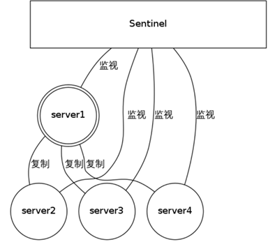

# Redis 入门指北

## 概念

redis是一个使用ANSI C编写的开源，支持网络，基于内存，可选持久性的键值对(key-value)存储数据库。

### redis的特性
	- 高速读写，数据类型丰富
	- 支持持久化，多种内存分配及回策略
	- 支持弱事项，消息队列，消息订阅
	- 支持高可用，支持分布式分片集群

### 启动实例
	
- 安装和启动参照官网
	
- 备份redis.conf文件  cp redis.conf{,bak,$(date +%F)}
	
	```
	[root@elk redis-4.0.6]# ll redis.conf*
	-rw-rw-r-- 1 root root 57764 Dec  4 12:01 redis.conf
	-rw-r--r-- 1 root root 57764 Mar 16 03:02 redis.conf2018-03-16
	-rw-r--r-- 1 root root 57764 Mar 16 02:43 redis.conf.bak
	```
	
- 精简配置文件
	
	```
	[root@elk redis-4.0.6] egrep -v '#|^$' redis.conf.$(date +%F) >redis.conf
 	[root@elk redis-4.0.6] cp redis.conf /etc
 	````
- 修改/etc/redis.conf配置文件 
 
 	11 logfile "/var/log/redis_6379.log"  # 配置redis 日志

- [redis启动脚本]()

- redis 多实例配置
	[reids多实例创建脚本]()
	[redis多实例启动脚本]()

###  reids数据持久化
redis提供了多种不同级别的持久化方式，一种是RDB，另一种是AOF

#### RDB持久化
	可以在指定的时间间隔内生成数据集的时间点快照
	- RDB是一个非常凑近的文件，它保存了redis在某个时间点上的数据集。这种文件非常适合备份。例如，在最近的24小时内每个小时进行一次备份，并在每月的每一天，也备份一个RDB文件。这样的话，就算遇到问题，也可以快速回滚
	- RDB可以最大化redis的性能。父进程在保存RDB文件时，惟一做的就是fork出一个子进程，子进程处理后面的所有操作，父进程不需要执行任何磁盘的I/O操作
	- RDB在恢复大数据集时的速度比AOF的恢复速度快
	- 缺陷：RDB对数据完整性要求不高，还有由于保存RDB文件，需要fork一个子进程，如果数据很大，对比AOF会比较耗资源
#### AOF持久化
	记录服务器执行的所有写操作命令，并在服务器时，通过重新执行这些命令来还原数据。AOF命令全以redis协议的格式来保存，新命令会追加到文件的末尾
	- AOF 可以让redis更耐久，可以使用不同的fsync策略：无fsync和每秒fsync，每次写的时候，会使用默认的每秒fsync策略。对数据的完整性
	- AOF 文件有序的保存了对数据库执行的所有写入操作，这些操作以redis协议格式保存。因此它的可读性比较好
redis还可以在后台对AOF文件进行重写(rewrite),使AOF的文件体积不会超过数据收集状态所需的实际大小。它可以使用RDB和AOF的持久化。在这种情况下，redis重启，它会优先使用AOF文件来还原数据集。因为AOF保存的数据集比RDB文件保存的数据集更完整。


### redis主从复制

```
[root@elk ~] redis-cli -p 6380/6381/6382
127.0.0.1:6380> SLAVEOF 127.0.0.1 6379
OK

```
	- 管理 
	- 主从复制状态监控 info replication
	- 主从切换	slaveof no one

### redis 集群	

redis集群是一个在多个redis节点之间进行数据共享的设施

#### 配置集群
```
去ruby官网 download 它的源码包 编译安装
直接 yum install ruby ruby-gem 安装的版本过低 导致创建集群失败
./redis-trib.rb create --replicas 1 192.168.8.157:6379 127.0.0.1:{6380..6385}
```

### redis HA实践

Redis Sentinel 功能
Redis-Sentinel是Redis官方推荐的高可用性(HA)解决方案，当用Redis做Master-slave的高可用方案时，假如master宕机了，Redis本身(包括它的很多客户端)都没有实现自动进行主备切换，而Redis-sentinel本身也是一个独立运行的进程，它能监控多个master-slave集群，发现master宕机后能进行自动切换。


sentinel是一个监视器，它可以根据被监视实例身份和状态来判定做何操作

#### sentinel的功能
- 监控(Monitoring)：
	他会不会断的检查主服务器和从服务器是否运作正常
- 提醒(Notification)：
	当被监控的某个redis服务器出现问题时，sentinel就可以通过API或其他应用程序通知到系统管理员
- 自动故障迁移(Automatic failover):
	当主服务器不能正常工作时，sentinel会开始一次自动故障迁移操作，将失效的主服务器中的一个从服务器升级为主服务器，并让失效主服务器中的从服务器修改主服务器为新的主服务器；当客户端尝试连接失效的主服务器时，集群会向客户端返回新的主服务器地址，是集群ok


